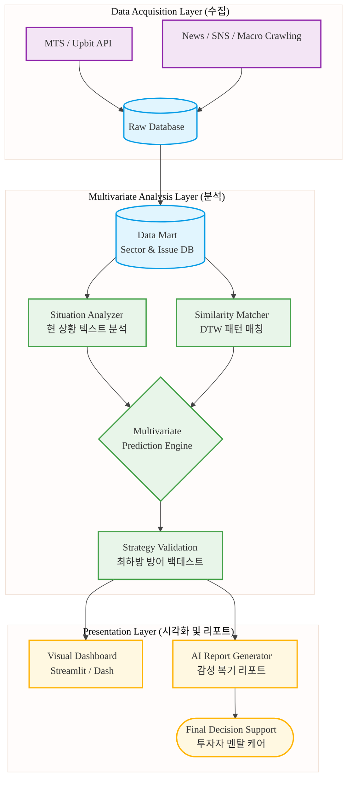

# AI 퀀트 트레이딩 연구: 다변량 분석 기반 최하방 방어 모델

## 1. 연구 개요 (Research Overview)
본 연구는 전통적인 통계학적 시계열 모델의 한계를 극복하고, 거대언어모델(LLM)과 다변량 분석(Multivariate Analysis)을 결합하여 '**최하방 지지선 방어**'에 특화된 퀀트 매매 전략을 탐색합니다. 
단순히 수익률을 극대화하는 것이 아니라, 역사적 패턴 유사도(DTW)와 거시적 감성 분석(Sentiment)을 결합하여 하락장에서의 손실을 원천 차단하는 **'절대로 잃지 않는' 모델** 구축이 핵심 목표입니다.

## 2. 핵심 연구 방향 (Strategic Direction)
- **Univariate to Multivariate:** 주가 데이터(단변량)에 의존하지 않고 뉴스, 전쟁, 매크로 지표, SNS 반응 등 외부 변수를 포함한 다변량 분석을 수행합니다.
- **Pattern & Sentiment Matcher:** 현재의 주가 모양과 비슷한 과거 시점을 찾고, 당시의 '뉴스 맥락(감성)'까지 비교하여 현재 흐름을 예측합니다.
- **Data Mart 기반 분석:** 매번 API를 호출하는 비효율을 제거하기 위해, 섹터별/이슈별로 정제된 데이터 마트를 구축(DB/AWS)하여 즉각적인 백테스트 환경을 조성합니다.
- **AI-Agentic Workflow:** 연구의 전 과정(데이터 수집, 코딩, 분석, 리포트)을 Claude Code, Codex 등의 AI 에이전트와 완벽히 통제된 환경에서 협업하여 수행합니다.

## 3. 시스템 아키텍처 (Architecture)
아래는 본 프로젝트의 데이터 수집부터 분석, 시각화까지의 전체 데이터 파이프라인입니다.



## 4. 환경 설정 및 실행 방법 (Setup & Execution)

### 4.1. 레포지토리 클론 및 의존성 설치
본 프로젝트는 속도와 의존성 관리에 최적화된 `uv` 패키지 매니저를 기반으로 작성되었습니다.

```bash
# 1. 저장소 클론
git clone <repository_url>
cd stock

# 2. uv를 활용한 가상환경 생성 및 종속성 동기화
uv sync

# 3. 메인 분석 스크립트 실행
uv run main.py
```

### 4.2. Kordoc MCP 활용 (문서 파싱)
연구 자료나 참고 문서를 AI 에이전트가 완벽하게 숙지할 수 있도록 `kordoc`을 활용합니다. 에이전트 세션 시작 시 아래 명령어를 통해 컨텍스트를 주입하세요.

```bash
# npx를 통한 kordoc 실행 (문서 파싱 및 요약)
npx -y @chrisryugj/kordoc ./materials/research_overview.docx
```
*에이전트는 위 명령의 출력을 읽어 프로젝트의 세부 목적을 잊지 않고 분석 코드를 작성해야 합니다.*

## 5. AI 에이전트(Claude Code / Codex) 협업 가이드

이 레포지토리는 AI 에이전트가 컨텍스트를 잃지 않고 작업을 이어갈 수 있도록 설계되었습니다. 에이전트 도구 실행 시 다음 수칙을 따르십시오.

1. **초기화:** Claude Code나 Cursor(Codex)를 열었을 때 가장 먼저 `history.md`와 `process.md`를 읽도록 지시합니다.
   - *Prompt ex: "현재 진행 상황을 파악하기 위해 history.md와 process.md를 읽고 다음 스텝을 제안해줘."*
2. **도구 최적화:** `skills.md`에 작성된 가이드라인을 바탕으로 에이전트가 어떤 라이브러리(e.g., fastdtw, transformers)를 사용할지 제한하고 최적화합니다.
3. **세션 종료:** 단일 작업(Step)이 끝나면 반드시 `history.md`에 결과를 요약 기록하게 하여 다음 세션으로 컨텍스트를 안전하게 인계합니다.

## 6. 향후 확장 및 배포 파이프라인 (Future Scalability)

본 프로젝트는 연구 단계를 넘어 실제 프로덕션(Production) 환경의 실시간 분석 시스템으로 확장될 수 있도록 다음과 같은 DevOps 인프라 연동을 염두에 두고 있습니다.

### 6.1. Workflow Automation (n8n)
- **목적:** 데이터 수집, 파이프라인 트리거, 결과 알림 전송을 자동화합니다.
- **연동 방안:** MTS API에서 데이터를 주기적으로 수집하는 스케줄러(Cron)나 분석된 AI 리포트를 Telegram/Slack으로 전송하는 파이프라인을 n8n의 노드 형태로 시각화하고 자동화합니다.

### 6.2. Containerization & Orchestration (Docker & Kubernetes)
- **목적:** 다수의 에이전트(상황 분석기, 패턴 매칭기 등)를 독립적인 마이크로서비스(MSA)로 분리하고 무중단 운영을 보장합니다.
- **연동 방안:** `uv` 기반의 파이썬 앱을 최적화된 Docker 이미지로 빌드합니다. 이후 시장 변동성이 심해져 분석 요청이 폭증할 경우, Kubernetes(K8s)의 HPA(Horizontal Pod Autoscaler)를 통해 매칭 엔진 Pod을 자동으로 스케일 아웃합니다.

### 6.3. Artifact Management (Sonatype Nexus)
- **목적:** 프라이빗 Docker 이미지, 학습이 완료된 딥러닝 모델 파일, 파이썬 패키지 등을 안전하게 저장하고 버전 관리합니다.
- **연동 방안:** CI/CD 파이프라인(GitHub Actions 등)을 통해 빌드된 Docker 이미지를 Nexus Repository에 Push하고, Kubernetes 클러스터 배포 시 외부 퍼블릭 망이 아닌 내부 Nexus 망에서 이미지를 Pull하여 보안과 속도를 향상시킵니다.
